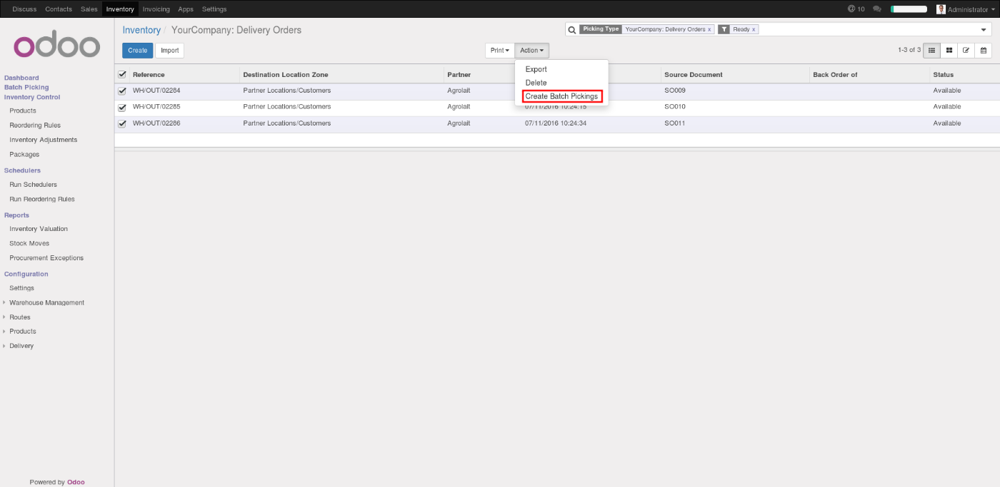
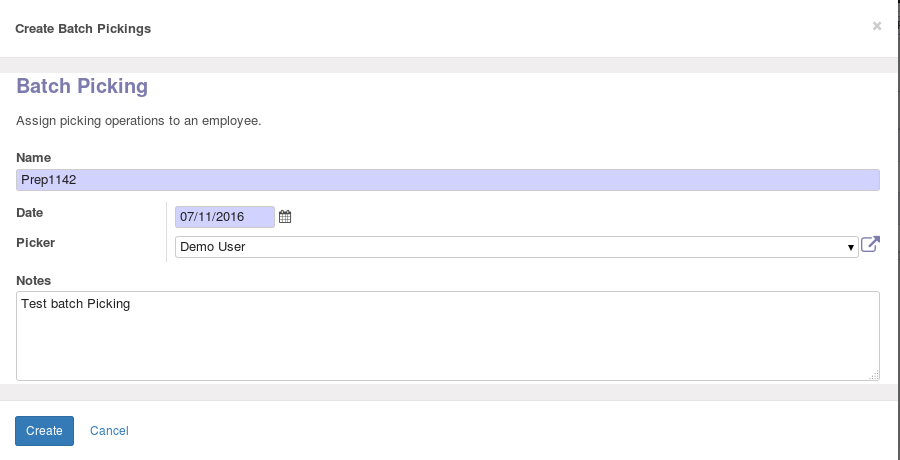
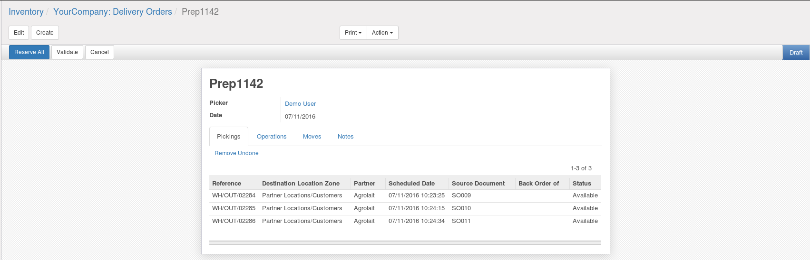

    :alt: License: AGPL-3
=========================

Stock Batch Picking

This module is based on `picking_dispatch <https://github.com/OCA/stock-logistics-workflow/tree/8.0/picking_dispatch>`_
but reworked for matching Odoo 9 new picking system (with pack operations).

Batch picking allows you to manage several pickings at the same time.
After having created a batch with a list of stock picking, you can:
* Check availability and reserve quants for all pickings
* Mark all pickings as done when delivery is done.
* Make partial delivery by filling done quantities in pack operations tab.
* Print a report to pick the proper goods at once

.. image:: static/batch_form_operation.png

Installation
------------

Configuration
-------------

Usage
-----

-----

-----

-----

-----

Known issues / Roadmap
----------------------

Bug Tracker
-----------

Bugs are tracked on `GitHub Issues
<https://github.com/OCA/stock-logistics-workflow/issues>`_. In case of trouble, please
check there if your issue has already been reported. If you spotted it first,
help us smashing it by providing a detailed and welcomed feedback.

Credits
-------

Images

* Odoo Community Association: `Icon <https://github.com/OCA/maintainer-tools/blob/master/template/module/static/description/icon.svg>`_.

[![Odoo Italia Associazione]]

### Contributors

picking_dispatch:
* Peter Langenberg <peter.langenberg@bubbles-it.be>
* Rudolf Schnapka <rs@techno-flex.de>
* Matthieu Dietrich <matthieu.dietrich@camptocamp.com>
* Romain Deheele <romain.deheele@camptocamp.com>
* Leonardo Pistone <leonardo.pistone@camptocamp.com>
* Guewen Baconnier <guewen.baconnier@camptocamp.com>
* Yannick Vaucher <yannick.vaucher@camptocamp.com>
* Alexandre Fayolle <alexandre.fayolle@camptocamp.com>
* Joël Grand-Guillaume <joel.grandguillaume@camptocamp.com>

stock_batch_picking:
* Cyril Gaudin <cyril.gaudin@camptocamp.com>

### Funders

### Maintainer

.. image:: https://odoo-community.org/logo.png
   :alt: Odoo Community Association
   :target: https://odoo-community.org

This module is maintained by the OCA.

OCA, or the Odoo Community Association, is a nonprofit organization whose
mission is to support the collaborative development of Odoo features and
promote its widespread use.

To contribute to this module, please visit https://odoo-community.org.

[//]: # (copyright)

----

**Odoo** is a trademark of [Odoo S.A.](https://www.odoo.com/) (formerly OpenERP, formerly TinyERP)

**OCA**, or the [Odoo Community Association](http://odoo-community.org/), is a nonprofit organization whose
mission is to support the collaborative development of Odoo features and
promote its widespread use.

**zeroincombenze®** is a trademark of [SHS-AV s.r.l.](http://www.shs-av.com/)
which distributes and promotes **Odoo** ready-to-use on its own cloud infrastructure.
[Zeroincombenze® distribution](http://wiki.zeroincombenze.org/en/Odoo)
is mainly designed for Italian law and markeplace.
Everytime, every Odoo DB and customized code can be deployed on local server too.

[//]: # (end copyright)

[//]: # (addons)

[//]: # (end addons)

